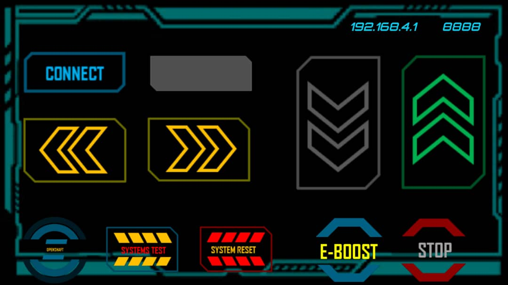

# Project OpenShaft (Programmable RC)

***Custom Remote Control App***

## Overview

This project was just me modifying some RC Toy trucks into programmble WiFi-controlled toy cars.
The RF cars could be controlled using a custom app I built for them and you could tune up or down certain characteristics by reprogramming their controllers

# Image

You  can find images of them in `images` folder

## Requirements

### 1. ESP8266 NodeMCU Controller

For this project, we used the Wemos D1 Mini with an ESP8266 SOC with wifi support. Its form-factor really came in handy when fitting it into the the toy car

### 2. L293D Driver IC

I used this driver IC  to drive the two motors on the car (The drive train and steering motor). The IC supports bi-directional control which is important if you want to go left and right , forwards and backwards

### 3. Arduino IDE

To program the toy car, I used the Arduino IDE and in this case , no additional libraries are needed

### 4. Python3

I also included a small Python library which I wrote so that I could expand control of the car to other systems
The library could be used to automate the controls from a laptop or even PC keyboard input

### 5. RST-Racing Project 
This folder contains code for 10 of the RC Trucks that were modified

### 6. final
This folder contains code in the folders `CodeRACER`, `CodeRACER-ML` , `OpenShaft`, `OpenShaft_Speed_Locked`, `OpenShaftv1`

## License

This project is open-source and released under the [MIT License](LICENSE)
